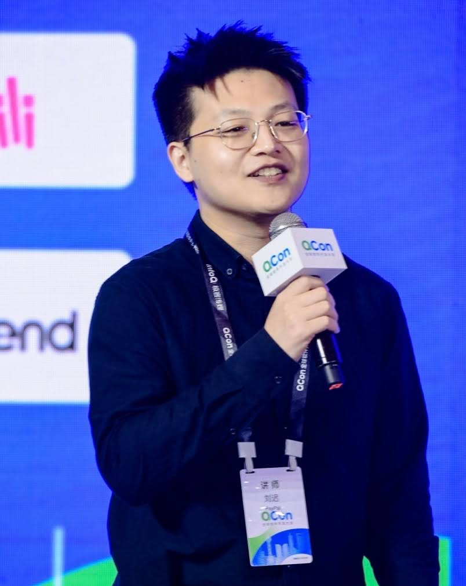

<a href="{{ site.baseurl }}/en">English</a> | 中文

本硕毕业于武汉大学，现为 PayPal AI Platform 大模型方向 Tech Lead，支撑数千模型与数百亿推理请求的 AI 平台建设。长期专注于大语言模型、强化学习、Graph、Post-Training、智能体（Agent）以及大模型量化推理等方向的研究与实践。

拥有 10 多项国家发明专利，发表多篇学术论文。曾就职于百度，专注于高性能数据科学引擎、AI 机器学习平台等。

# 学术论文

- **Adaptive-Boundary-Clipping GRPO: Ensuring Bounded Ratios for Stable and Generalizable Training**  
  Chi Liu, X Chen | 2026  
    [paper](https://arxiv.org/abs/2601.03895) | [github](https://github.com/chi2liu/adaptive-boundary-clipping-grpo)

- **Rethinking GSPO: The Perplexity-Entropy Equivalence**  
  Chi Liu | 2025  
    [paper](https://arxiv.org/abs/2510.23142)

- **Fraud Detection Through Large-Scale Graph Clustering with Heterogeneous Link Transformation**  
  Chi Liu | 2025 | 引用: 1  
    [paper](https://arxiv.org/abs/2512.19061)

# 专利

- **Container Image Processing Method and Apparatus, and Non-Transitory Computer-Readable Storage Medium**  
  Chi Liu, Ziheng Li, Kai Chen, Xiaoning Yu, Hui Han  
  US Patent US11880341B2, 2024  
  Assignee: Beijing Baidu Netcom Science and Technology Co Ltd  
    [patent](https://patents.google.com/patent/US11880341B2)

- **A Method, Device, Equipment and Medium for Realizing Joint Modeling**  
  Hui Han, Kai Chen, Chi Liu, Jiayi Yang  
  Chinese Patent CN112182635B, 2024  
  Assignee: Beijing Baidu Netcom Science and Technology Co Ltd  
    [patent](https://patents.google.com/patent/CN112182635A)

- **Operating Environment Acquisition Method, Device and Electronic Device**  
  Kai Chen, Hui Han, Xiaoning Yu, Chi Liu, Ziheng Li, Jiayi Yang  
  Chinese Patent CN110908675B, 2023  
  Assignee: Beijing Baidu Netcom Science and Technology Co Ltd  
    [patent](https://patents.google.com/patent/CN110908675A)

# 开源贡献

积极参与大模型生态核心开源项目，包括为 vLLM 调度器实现 ~18.7% 性能提升、为 Verl 修复 GPU 设备放置问题带来 ~6.5× 加速等。贡献涵盖 LLM 推理引擎（vLLM、SGLang）、强化学习训练框架（Hugging Face TRL、Verl）、MCP 框架（FastMCP）以及智能体框架（CrewAI）。[**查看完整贡献列表 →**]({{ site.baseurl }}/opensource)

# 公开演讲
- [从 MLOps 到 LLMOps，支持数千模型与数百亿推理请求的 AI for Data 平台探索](https://qcon.infoq.cn/2024/shanghai/presentation/6151) (QCon 2024)  
  分享 PayPal 如何构建统一的端到端企业级 AI 平台，打破数据孤岛，支撑数千模型与数百亿推理请求；以及从 MLOps 快速扩展到 LLMOps 的实践经验，涵盖 LLM 推理优化、RAG 与 Multi-Agent 低代码框架、语义缓存及幻觉检测等 GenAI 落地方案。

（最后更新：2026 年 3 月）
